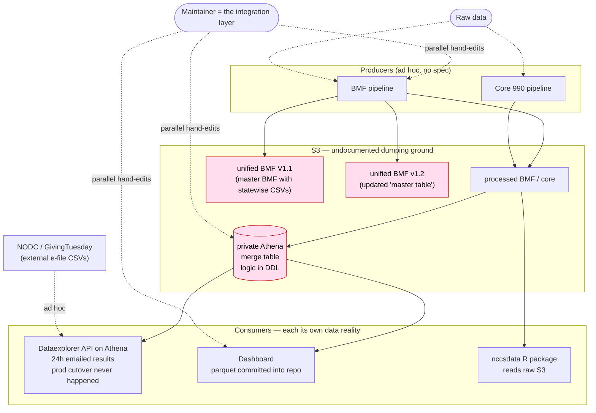
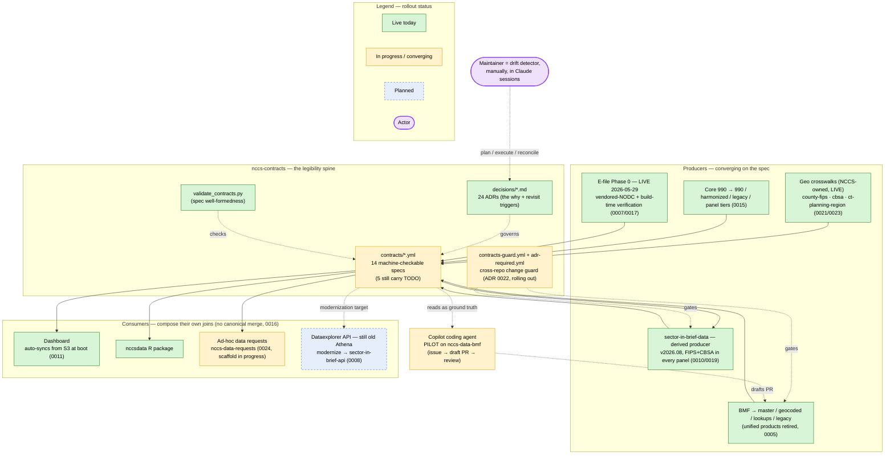
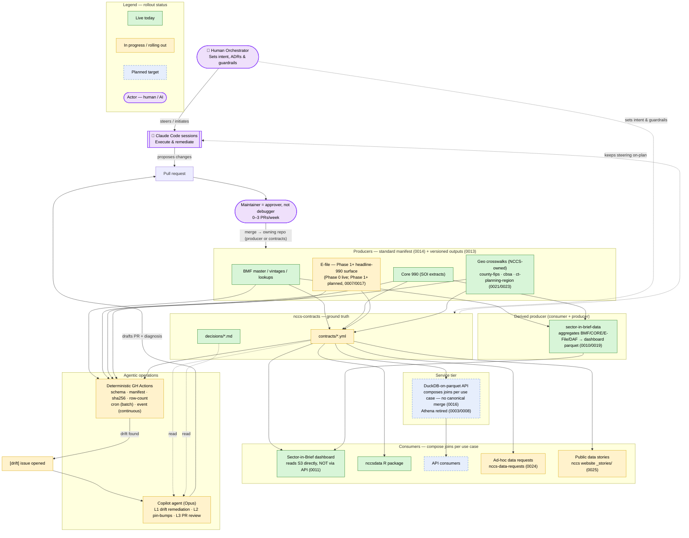

# A practical agentic approach to systems design

This document tells the story of one system — the NCCS data system — in
three states: **what it was**, **what it is now**, and **what it becomes
when complete**. The point is not the data system itself. The point is
the *method*: how you take a tangled, human-glued system and make it
safe to hand parts of it to agents.

The throughline, stated once up front:

> **You do not start by adding agents. You start by making the system
> legible — to a machine and to a stranger — and the agents become the
> payoff of that legibility, not its precondition.**

The legibility surface here is two things, both plain text in git:

- **Contracts** (`contracts/*.yml`) — machine-checkable specs of every
  artifact: where it lives, its schema, its cadence, who consumes it.
  The *ground truth* an agent (or a human) diffs reality against.
- **ADRs** (`decisions/*.md`) — the decision log: every load-bearing
  call, its alternatives, and a revisit trigger. The *why* that lets an
  agent make a borderline judgment the way the team would.

Everything below is an argument for building those two things *first*.

---

## State 1 — Old: human-glued, two realities, silent drift

**What's true here.** Each consumer reached its own version of the data.
The API and dashboard read a **private merge** materialized as an
Athena table, with the join logic buried in pipeline/DDL code and *no
audit trail*. The R package and direct-S3 users read the raw artifacts.
When a BMF or core column changed, **both realities had to be patched in
parallel, by hand.** Meanwhile several competing "one unified BMF table"
products (`harmonized/bmf/unified` V1.1, `bmf/unified/v1.2`) coexisted,
each believing it was canonical. The API ran on Athena (minute-scale
latency, results emailed 24 hours later), its production cutover had
never happened so it wrote to a `stg` bucket while the `prod` bucket sat
abandoned, and multi-gigabyte query results accumulated with no
retention policy.

**Why it hurt.** Nothing was a *spec* — everything was an
implementation. There was no artifact you could point at and ask "is
this still true?", so drift was silent until a consumer broke. The only
component that knew how the pieces fit together was the maintainer's
memory. **You could not safely automate any of this, because there was
nothing for an automation to check against.** An agent dropped into this
world would have no ground truth — only code to imitate.

---

## State 2 — Current: the spine is built, the first agent is piloting

**What changed.** The contract surface now *exists*. `S3 is the contract
surface` (ADR 0001): every producer publishes parquet + a manifest +
versioned URLs + a `latest/` pointer, and every consumer pins a version.
The competing BMF products were retired in favor of one canonical master
(ADR 0005). The private Athena merge was **reversed**: ADR 0002 had
planned a canonical merged artifact; ADR 0016 superseded it once the
real consumers (the dashboard, the new API) both turned out to compose
their *own* joins — so the design now says, explicitly, *no canonical
cross-dataset merge*. E-file became an Urban-owned, contracted producer
and **shipped its first vintage during the work that produced this
document**.

**Where the agents are.** Honestly: the automated loops described in
`ARCHITECTURE.md` §9 **do not run yet**. Today the "drift detector" is
the maintainer, by hand, in an AI-assisted session. But the first
concrete step is live — the **GitHub Copilot coding agent has been
piloted on `nccs-data-bmf`**: it was handed a contract-audit issue, read
the sibling `nccs-contracts` specs as ground truth, and opened a PR — a
real run of "agent reads the contract, drafts a change, human reviews."

**Why this is the pivotal state.** The expensive, un-skippable work was
never the agents — it was writing down the contracts and the ADRs. That
work is mostly done. The system is now *legible*: a stranger (or a
model) can read `contracts/` + `ARCHITECTURE.md` and know what's true
and why. That legibility is what makes the next state reachable at all.

---

## State 3 — Complete: deterministic checks find drift, agents draft fixes, humans approve

**What it buys.** The loop closes. A producer publishes; a **cheap,
deterministic check** (not an agent) diffs the artifact against its
contract; if and only if it finds drift, it opens an issue; **the
expensive agent wakes only then**, reads the contract + the linked ADR,
investigates which side is actually stale, and drafts a PR with a
diagnosis in whichever repo owns the fix. Three loops run on this shape:
drift remediation, cross-repo version-pin bumps, and contract-adjacent
PR review. The maintainer reviews 0–3 agent PRs a week and **never
debugs the integration layer by hand** — that job no longer exists,
because the contract *is* the integration layer.

The remaining work to get here is enumerated honestly in
`ARCHITECTURE.md` §9 ("Not yet built"): per-producer publish hooks, the
cron/event issue-opener, Copilot configuration, and finishing the
populated contract surface. None of it is exotic; all of it is
*unblocked by the spine already existing*.

---

## The method, distilled

The transferable lessons — what "a practical agentic approach to systems
design" actually means:

1. **Legibility before autonomy.** The prerequisite for an agent is not
   a better model; it's a *checkable specification of correctness*. Build
   the contract surface first. Agents are the dividend.

2. **Two artifacts carry the system: the spec and the decision log.**
   Contracts say *what is true*; ADRs say *why, and when to reconsider*.
   An agent needs both — the spec to diff against, the ADR to make a
   judgment call the way the team would. ([CONTRIBUTING.md](../CONTRIBUTING.md)
   describes the plan → execute → reconcile loop that keeps them current.)

3. **Cheap-deterministic finds the problem; expensive-agentic fixes
   it.** Don't loop an LLM on a schedule. Let free GitHub Actions do the
   diffing on every publish/cron, and wake the agent *only* when a
   deterministic check has already found drift. Cost scales with real
   work, not with calendar time.

4. **The human is the approver, not the debugger.** Agents draft; they
   never merge their own PRs. The maintainer's job shrinks to judgment —
   the one thing not yet safe to delegate.

5. **Let the system reverse itself in the open.** The strongest evidence
   this method works is ADR 0002 → 0016: a load-bearing decision
   (a canonical merge) was *reversed* a year later when reality pulled
   the other way, and the reversal is a reviewable document with its
   rationale intact. A system that can change its mind legibly is one you
   can trust an agent to operate.

6. **Ground truth, not vibes — for agents and for reviewers.** When the
   pilot agent produced a contract audit, its conclusions were verified
   against the actual code and the actual contracts before being trusted
   — the same discipline the contracts impose on the producers. An
   agent's output is itself a proxy; check it at the point of decision.

---

## Where we are on the curve

State 1 is gone. We are in **State 2**: the spine (contracts + ADRs +
validator) is built and populated, producers are converging on it,
e-file Phase 0 is live, and the first Copilot agent has completed a
real pilot run on `nccs-data-bmf`. State 3 is unblocked — what remains
is wiring deterministic checks to issue-creation and pointing the agent
at them. The hard part (making the system legible) is behind us; the
rest is plumbing.
